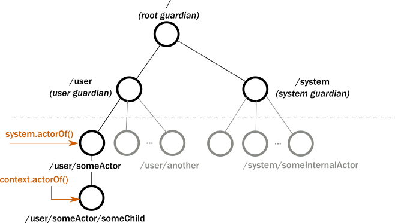

# AKKA hello World example
Simple example to istance the system actor, create an actor and send a message to the actor.
How the actors are working: imagine in the household appliances or the goods communicating each with others. 
So in the scenario the goods will be the actors and the communication will be the messages that they 
are sending ones to others.    

# Actor tree
